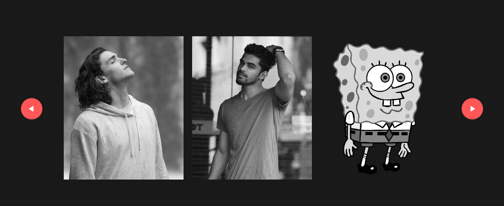

# 🚀 Build with JavaScript

Welcome to our collection of mini JavaScript projects Before diving into these projects, it's essential to have a solid understanding of the basics of HTML, CSS, and JavaScript. These foundational languages are the cornerstone of web development, enabling you to structure, style, and add interactivity to web pages effectively.

## 📦 What's Inside?

This repository showcases a variety of mini projects, each demonstrating a unique aspect of JavaScript. From simple calculators to interactive quizzes, these projects will help you grasp the fundamentals of JavaScript and beyond.

### 🛠️ Projects Included

#### [Calculator App 🧮](1-Calculator/README.md)


Perform basic arithmetic operations with ease.

#### [Notes App 📝](2-Notes-App/README.md)


Store your tasks locally and never forget what needs doing.

#### [Image Slider 🖼️](3-Image-Slider/README.md)


Navigate through a gallery of images effortlessly.

#### [Quiz App 🎯](4-Quiz-App/README.md)


Test your knowledge on various topics with our multiple-choice quizzes.

#### [Form Validator ✅](5-Form-Validator/README.md)


Learn the basics of form validation and ensure your forms are robust.

#### [Text to Speech Converter 🗣️](6-Text-To-Speech-Converter/README.md)


Convert text to speech using the browser's capabilities.

## 🌟 Features

- **Easy to Understand:** Built with HTML, CSS, and vanilla JavaScript.
- **Beginner-Friendly:** Designed to be simple yet informative.
- **Well-Organized Code:** Clear comments and structure for learning purposes.

## 🕹️ How to Get Started

1. **Clone the Repository**
   ```bash
   git clone https://github.com/MHuzaifaRauf/build-with-javascript.git
   ```

2. **Navigate to the Project Directory**
   ```bash
   cd build-with-javascript
   ```

3. **Launch the Projects**
   - Open the `index.html` file in your browser to start exploring!

## 🛠️ Technologies Used

- HTML
- CSS
- JavaScript (vanilla)

## 👥 Contributing

Contributions are welcome. If you spot any issues or have ideas for improvement, please create an issue or submit a pull request.

## 💡 Why These Projects?

These projects serve as an excellent starting point for those new to JavaScript. They cover a wide range of functionalities, from basic operations to more complex features, providing a comprehensive learning experience.

## 🏁 What's Next?

After mastering these projects, consider diving deeper into frameworks like React, Angular, or Vue.js. Explore backend development with Node.js or database management with MongoDB to broaden your skill set.

## 🎉 Happy Coding!

Remember, the journey of a thousand miles begins with a single step. Keep coding, keep learning!
